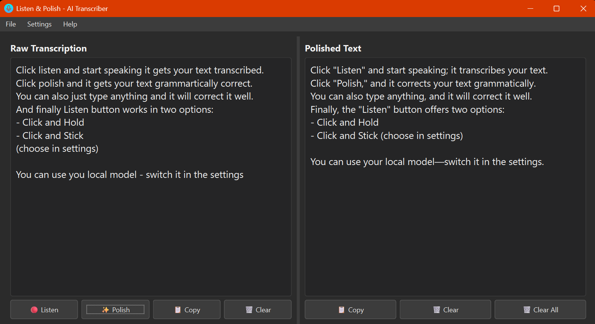

# **LISTEN & POLISH -  AI Transcriber**

A desktop application for Windows (Mac and Linux - use Python script or build your own distributive) that allows you to transcribe your speech in real-time, polish the text using AI, and manage your transcriptions with a simple and intuitive interface.

==**Free API key from Google AI GEMINI in 2025:**== [How To Get Your FREE Google Gemini API Key (2025)](https://youtu.be/6BRyynZkvf0?si=1DJ6NHVoif5fRpCr)

How to use - see the screenshot:

How to get key (I still highly recommend to watch that youtube video above):
- Login in https://aistudio.google.com/
- Click GET API Key in the top right corner
- Go through the steps (it is easy) copy the key and paste in the app.
- How much will you pay - unless for any reason you don't get FREE API KEY from Google GEMINI, you it is still cheap as dirt.
- TRANSCRIPTION IS ALWAYS FOR FREE! You don't need a key for it, you need key only for Polishing the text.
- You can install LM Studio or other local AI programs and if you machine is powerful enough you don't need API key at all.

## **Tech stuff (don't read it you are not a nerd)**

- **Interactive Transcription**: Use your microphone to transcribe speech directly into the editor at the cursor's position. Select text to replace it with a new transcription.
- **AI-Powered Polishing**: Polish the entire text or just a selection using an AI (Gemini or a local model) to correct grammar, improve phrasing, and fix typos.
- **Modern Theming**: Choose between beautiful, consistent light and dark themes (e.g., Litera, Cyborg, Darkly) powered by the ttkbootstrap library.
- **Flexible AI Options**: Easily switch between Google's Gemini API and a local AI model running on your machine (e.g., via LM Studio).
- **Session Management**:
    - **Save & New**: Save your current transcription and the polished text to a JSON file and clear the editors for a new session.
    - **Open**: Load a previously saved session to continue your work.
- **Persistent Settings**: Your API key, AI service preference, and theme choice are saved automatically between sessions.

## **Setup and Installation**

Follow these steps to run the application from the source code.

### **1\. Prerequisites**

- It is tested on Python 3.13.3
- A working microphone.

### **3\. Install Dependencies**

Open a command prompt or PowerShell terminal, navigate to your project folder, and run the following command to install the required Python libraries:

`pip install -r requirements.txt`

### **4\. Running the Application**

To run the application directly from the script, use the following command in your terminal:

`python transcriber.py`

## **Creating a Standalone Executable (.exe)**

You can package the application into a single .exe file that can be run on any Windows computer, even without Python installed.

1.  Install PyInstaller:  
    If you haven't already, install PyInstaller:  
    `pip install pyinstaller`
    
2.  Build the Executable:  
    In your terminal, from the project directory, run the following command. It is recommended to run PyInstaller as a Python module to avoid potential path issues.  
    `python -m PyInstaller --onefile --windowed --name="Smart AI Recorder Transcriber" --icon="icon.ico" transcriber.py`  
    or (if you want to create with embedded icon image):  
    `python -m PyInstaller "Listen and Polish - AI Transcriber.spec"`
    
    - \--onefile: Bundles everything into a single .exe file.
    - \--windowed: Prevents a console window from appearing when the application runs.
    - \--name: Sets the name of the final executable.
3.  Find Your Application:  
    Once the process is complete, you will find Smart AI Recorder Transcriber.exe inside a new folder named dist. You can share this file with others.